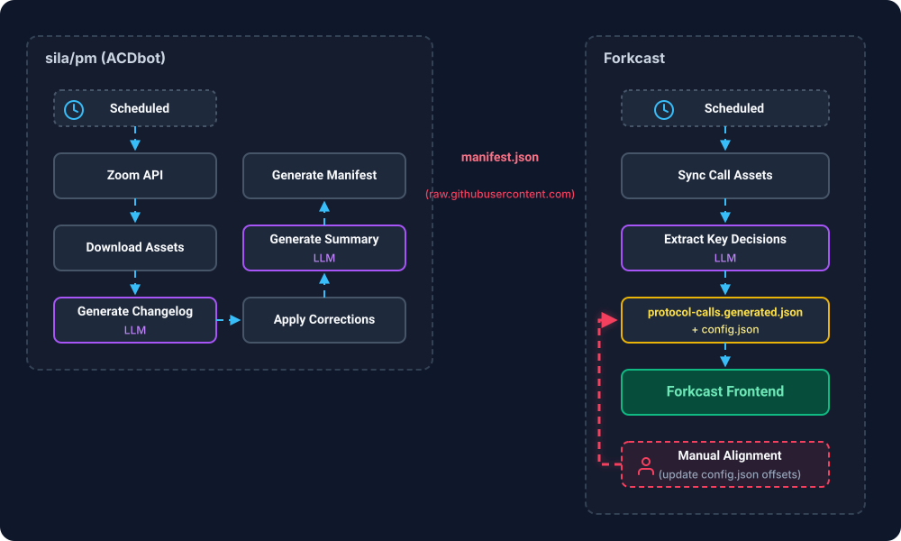

# ACDbot-to-Forkcast Asset Pipeline

The asset pipeline transforms Zoom meeting recordings into browsable call pages on [Forkcast](https://github.com/sila-chain/forkcast). It spans two repositories — [sila/pm](https://github.com/sila-chain/pm) and Forkcast — connected by a shared manifest. ACDbot produces assets on the PM side; Forkcast consumes them.

## Architecture



## How It Works (PM Side)

The pipeline lives in `pm/.github/ACDbot/scripts/asset_pipeline/` and is orchestrated by `run_pipeline.py`. It runs on a schedule via `meeting-asset-pipeline.yml`, or on manual dispatch for a specific series/call.

### Pipeline steps

| Step | Script | What it does |
|------|--------|-------------|
| 1 | `download_zoom_assets.py` | Fetches transcript (`.vtt`), chat (`.txt`), and optionally Zoom's AI summary (`.json`) from the Zoom API. Selects the longest recording (>10 min) if multiple exist for one date. |
| 2 | `generate_changelog.py` | Sends the transcript + `ethereum_vocab.yaml` to an LLM (configurable via `--model`). Returns a TSV of corrections with confidence levels (high/medium/low). |
| 3 | *(human review)* | In manual mode, the operator reviews the changelog. In CI mode (`--auto-approve`), this step is skipped. |
| 4 | `apply_changelog.py` | Applies TSV corrections to produce `transcript_corrected.vtt` via global string replacement. |
| 5 | `generate_summary.py` | Sends the transcript, chat, and GitHub issue agenda to an LLM. Produces `tldr.json` — a structured summary with highlights, action items, decisions, and targets. |
| 6 | `generate_manifest.py` | Scans all artifact directories and writes `manifest.json` — the contract that Forkcast reads. |

### Artifact directory structure

Each call produces a directory at `pm/.github/ACDbot/artifacts/{series}/{date}_{number}/`:

```
artifacts/acdc/2026-02-19_175/
  transcript.vtt              # Original Zoom transcript
  transcript_corrected.vtt    # Cleaned transcript (after changelog applied)
  transcript_changelog.tsv    # Correction log (TSV: original, corrected, confidence)
  chat.txt                    # Zoom chat log
  tldr.json                   # Structured meeting summary
```

### Manifest structure

`manifest.json` is the upstream index that Forkcast reads to discover new calls. Top-level structure:

```json
{
  "version": 1,
  "series": {
    "acdc": {
      "name": "All Core Devs - Consensus",
      "youtubePlaylist": "PLJqWcTqh_zKFtf6yUxjwjE5P1gsDSIPjV",
      "calls": [
        {
          "date": "2026-02-19",
          "path": "acdc/2026-02-19_175",
          "number": 175,
          "issue": 1930,
          "videoUrl": "https://youtube.com/watch?v=o4fNYC3FTE4",
          "resources": {
            "transcript": "transcript.vtt",
            "transcript_corrected": "transcript_corrected.vtt",
            "changelog": "transcript_changelog.tsv",
            "chat": "chat.txt",
            "tldr": "tldr.json"
          }
        }
      ]
    }
  }
}
```

## How It Works (Forkcast Side)

Two scripts run sequentially via `sync-call-assets.yml` (scheduled cron). Both live in `forkcast/scripts/`.

### Step 1: Sync call assets (`sync-call-assets.mjs`)

1. **Fetches** `manifest.json` from `https://raw.githubusercontent.com/sila/pm/master/.github/ACDbot/artifacts/manifest.json`.
2. **Maps** PM series names to Forkcast short codes (i.e. `glamsterdamrepricings` → `price`, `rpcstandards` → `rpc`). Core series like `acdc`, `acde`, `acdt` pass through unchanged. The full mapping is defined in `SERIES_TO_TYPE` in `sync-call-assets.mjs` — series not in `KNOWN_TYPES` are skipped with a console warning.
3. **Filters** — only syncs calls that have a `videoUrl` AND at least one of `tldr`, `transcript`, or `transcript_corrected`.
4. **Downloads** new assets to `forkcast/public/artifacts/{type}/{date}_{number}/`. Skips files that already exist locally unless `--force` is passed. Bundled breakout assets (e.g. the ACDT CL breakout's `transcript_cl.vtt`, `chat_cl.txt`, `tldr_cl.json`) download into the same directory as the parent call's assets.
5. **Generates `config.json`** for each call — stores the issue number, video URL, and sync offsets. For livestreamed types (`acdc`, `acde`), sync times start as `null` (manual sync required). For all others (raw Zoom recordings, including `acdt`), offsets default to `"00:00:00"`. If the manifest entry has `breakoutVideoUrls`, a `breakouts` map is added with each breakout's video URL and zero-sync defaults.
6. **Updates `src/data/protocol-calls.generated.json`** — the frontend's call index, sorted by type then date. This file is additive — entries are never pruned automatically, so removing a call requires a manual edit.

### Step 2: Extract key decisions (`extract-key-decisions.mjs`)

Runs only on ACD call types (`acdc`, `acde`, `acdt`):

1. Reads `tldr.json` from each artifact directory.
2. Sends the TLDR to an LLM for classification.
3. Writes `key_decisions.json` per call with structured decision objects.

Each decision has a `type`:

| Type | Meaning | Example |
|------|---------|---------|
| `stage_change` | SIP moves to a new stage (CFI, SFI, DFI, Included, Withdrawn) | "SIL/70 CFI'd for Glamsterdam" |
| `devnet_inclusion` | SIP first added to a devnet | "SIL/70 part of bal-devnet-3 spec" |
| `headliner_selected` | SIP selected as fork headliner | "FOCIL (SIP-7805) selected as Hegota headliner" |
| `other` | Anything else notable | Status updates, timeline changes |

### Step 3: Commit and deploy

If any files changed, the workflow commits, pushes, and triggers the `deploy.yml` workflow. The call is now live on Forkcast — but for livestreamed calls, video/transcript playback alignment won't work yet (see [Step 4](#step-4-manual-sync-livestreamed-calls-only)).

### Step 4: Manual sync (livestreamed calls only)

After a livestreamed call (acdc, acde) is deployed, a Forkcast engineer must manually set the sync offsets in `config.json`. The automated pipeline does not wait for this — it ships the call with `null` offsets, so the transcript and video are available but not aligned. See [Video/Transcript Sync](#videotranscript-sync) for how to set the offsets.

### Forkcast artifact directory

After sync, each call directory looks like this:

```
public/artifacts/acdc/2026-02-19_175/
  transcript_corrected.vtt    # Downloaded from PM (preferred over transcript.vtt)
  transcript_changelog.tsv    # Downloaded from PM
  chat.txt                    # Downloaded from PM
  tldr.json                   # Downloaded from PM
  config.json                 # Generated by sync script
  key_decisions.json          # Generated by extract-key-decisions (ACD calls only)
```

## Video/Transcript Sync

Forkcast plays YouTube video alongside the VTT transcript. For playback to align, the app needs two sync offsets stored in each call's `config.json`:

- **`transcriptStartTime`** — when meaningful speech begins in the transcript
- **`videoStartTime`** — the corresponding moment in the YouTube video

### Livestreamed calls (acdc, acde)

These calls are streamed live to YouTube with intro screens, countdown timers, or pre-roll. The Zoom transcript starts recording at a different moment than the YouTube stream begins. This means the offsets must be set manually **after the call is already live on Forkcast**.

The automated pipeline ships livestreamed calls with `null` sync offsets:

```json
{
  "sync": {
    "transcriptStartTime": null,
    "videoStartTime": null
  }
}
```

The call page works — you can watch the video and read the transcript — but synchronized playback (highlighting the transcript line as the video plays) won't function until a Forkcast engineer sets the offsets.

**To set the sync manually (post-deploy):**

1. Open the YouTube video. Find the timestamp where the host first speaks (e.g., `00:03:55`).
2. Open `transcript_corrected.vtt`. Find the same moment (e.g., `00:06:55`).
3. Update `config.json` in `public/artifacts/{type}/{date}_{number}/`:
   ```json
   {
     "sync": {
       "transcriptStartTime": "00:06:55",
       "videoStartTime": "00:03:55"
     }
   }
   ```
4. Commit and push. The deploy workflow handles the rest.

### Non-livestreamed calls

For calls recorded directly in Zoom (no live stream) — including `acdt` — the transcript and video start at the same moment. The sync script defaults both offsets to `"00:00:00"`, and no manual intervention is needed.

**Note:** Some non-livestreamed calls (e.g., BAL breakouts) still receive manual sync if the recording has dead air at the start. This is optional — the defaults work for most cases.

**History:** From June to July 2026 ACDT videos were "composed" recordings (bumper + trimmed Zoom recording), and PM published per-call sync offsets in the manifest. That feature was removed upstream (sila/pm commit `62c78274`); ACDT uploads are raw Zoom recordings again.

### Bundled breakouts (ACDT CL)

Since ACDT 087, the CL breakout is recorded in the same Zoom meeting window as the main testing call and published as part of the same manifest entry. The manifest carries extra resources suffixed with the breakout kind (`transcript_cl.vtt`, `chat_cl.txt`, `tldr_cl.json`) plus a `breakoutVideoUrls` map:

```json
{
  "videoUrl": "https://www.youtube.com/watch?v=main",
  "breakoutVideoUrls": {
    "cl": "https://www.youtube.com/watch?v=breakout"
  }
}
```

Forkcast downloads the suffixed assets into the parent call's artifact directory and records each breakout in the call's `config.json`:

```json
{
  "breakouts": {
    "cl": {
      "videoUrl": "https://www.youtube.com/watch?v=breakout",
      "sync": { "transcriptStartTime": "00:00:00", "videoStartTime": "00:00:00" }
    }
  }
}
```

The call page reads `breakouts` from the config and renders a tab per kind with its own video, transcript, chat, and summary. Breakout videos are raw Zoom recordings, so zero sync is the default; offsets can be tuned manually per breakout just like the main call's, and the sync script preserves tuned offsets on later runs. Older ACDT breakouts (074–084) predate this pipeline and are registered manually in `src/data/breakouts.ts` with chat-only assets.

## Adding a New Call Series

When a new call series is added to sila/pm (e.g., "PQ Interop"), Forkcast needs changes in several files before it can sync and display those calls. The series must already exist in the PM manifest — Forkcast only consumes what the manifest provides.

### Checklist

Use the table below as a checklist. Every new series requires all of these changes.

| # | File | What to do |
|---|------|-----------|
| 1 | `src/data/calls.ts` | Add the short code to the `CallType` union and add a `name: 'Display Name'` entry to `callTypeNames`. If the series has an associated SIP, add it to `eipCallTypes`. |
| 2 | `scripts/sync-call-assets.mjs` | Add the short code to `KNOWN_TYPES`. If the PM series name differs from the short code (it usually does for breakouts), add a mapping in `SERIES_TO_TYPE`. |
| 3 | `src/components/calls-index/CallsIndexTimeline.tsx` | Add the short code with a color to both maps: `CALL_TYPE_BORDER_COLORS`, `CALL_TYPE_BADGE_COLORS`. |
| 4 | `src/components/HomePage.tsx` | Add the short code to the `callTypeBadgeColors` map. |
| 5 | `src/domain/calls/upcomingCalls.ts` | Add an entry to `UPCOMING_CALL_SERIES_TO_TYPE`, keyed by the lowercased `### Call Series` value (e.g. `'encrypt the mempool'`). |

### Naming conventions

- **Short code** (`CallType`): A terse lowercase identifier used in URLs, file paths, and the generated JSON. Examples: `acdc`, `focil`, `pqi`. Pick something 2-5 characters that matches the badge text.
- **PM series name**: The key used in the PM manifest's `series` object. This is typically the full name lowercased with spaces removed (e.g., `pqinterop`, `allwalletdevs`, `glamsterdamrepricings`). If it differs from the short code, add a `SERIES_TO_TYPE` mapping.
- **Display name** (`callTypeNames`): The human-readable name shown in tooltips (e.g., `"PQ Interop"`, `"FOCIL Breakout"`).
- **Badge text**: What appears in the colored pill on the calendar. This is `call.type.toUpperCase()` — so the short code determines the badge text (e.g., `pqi` renders as `PQI`).

### Verifying

After making all changes, run `npx tsc --noEmit` — the `Record<CallType, string>` types will catch any maps you missed. `SERIES_TO_TYPE` and `UPCOMING_CALL_SERIES_TO_TYPE` are not type-enforced; verify those by hand. Then run the sync script to confirm the new series is recognized:

```sh
node scripts/sync-call-assets.mjs
```

If the PM manifest already has calls for the series, they should sync down. If not, you'll see the series listed with 0 calls — that's fine, they'll appear once the PM pipeline produces them.

## Troubleshooting

### A call is missing from Forkcast

**Check the manifest first.** The sync script only pulls calls present in `manifest.json` with a `videoUrl` AND at least one text asset (TLDR, transcript, or corrected transcript). Common causes:

1. **No `videoUrl` yet.** The video hasn't been uploaded to YouTube, or the manifest hasn't been regenerated after upload. Check `pm/.github/ACDbot/artifacts/manifest.json` for the call entry.
2. **No text assets yet.** The PM pipeline hasn't completed processing. Check `pm/.github/ACDbot/artifacts/{series}/{date}_{number}/` for the expected files.
3. **Series not in `KNOWN_TYPES`.** If a new call series was added to PM but not to Forkcast's sync script, it will be skipped (with a console warning). Add it to `SERIES_TO_TYPE` and `KNOWN_TYPES` in `sync-call-assets.mjs`.
4. **Series in `DENYLIST`.** If a series was temporarily blocked from syncing (e.g., during a bad data incident), check `DENYLIST` in `sync-call-assets.mjs` and remove the entry.

### Forkcast shows a dead or wrong video link

This happens when someone checks **"create youtube livestream link"** on the PM repo GitHub issue but never actually streams via OBS. ACDbot creates a YouTube scheduled stream URL and marks `skip_youtube_upload: true`. The manifest picks up the stream URL (which points to a broadcast that never went live), and Forkcast syncs it as the video link.

This happened with RPC Standards #21 (sila/pm#1943). The fix requires PM-side intervention:

1. In `meeting_topic_mapping.json`, find the call entry and set `youtube_streams` to `null` and `skip_youtube_upload` to `false`.
2. Trigger the `youtube-uploader.yml` workflow via manual dispatch — pass the Zoom meeting ID as `MEETING_ID`. This uploads the actual Zoom recording to YouTube and sets `youtube_video_id` to the correct value.
3. Regenerate the manifest. The next Forkcast sync cycle picks up the corrected URL automatically — the sync script updates `videoUrl` in `config.json` whenever the manifest value differs from the local value.

**Why this happens:** `generate_manifest.py` checks `youtube_video_id` first (uploaded recording), then falls back to `youtube_streams[0]` (scheduled broadcast). If no recording has been uploaded but a stream was created, the dead stream URL wins.

### Assets synced in error (misfire)

This has happened — e.g., ETM call assets were synced from a meeting that didn't actually occur. Fix by:

1. Deleting the artifact directory from `public/artifacts/{type}/{date}_{number}/`.
2. Removing the entry from `protocol-calls.generated.json` (this file is additive — entries are never pruned automatically).
3. Committing and pushing.

## File Reference

> [!NOTE]
> File paths may drift as the codebase evolves. If you notice a stale path, please update it.

### PM repo (`sila/pm`)

| File | Purpose |
|------|---------|
| `.github/ACDbot/scripts/asset_pipeline/run_pipeline.py` | Pipeline orchestrator |
| `.github/ACDbot/scripts/asset_pipeline/download_zoom_assets.py` | Downloads Zoom recordings, transcripts, chat |
| `.github/ACDbot/scripts/asset_pipeline/generate_changelog.py` | Generates transcript corrections via LLM |
| `.github/ACDbot/scripts/asset_pipeline/apply_changelog.py` | Applies corrections to produce cleaned transcript |
| `.github/ACDbot/scripts/asset_pipeline/generate_summary.py` | Generates structured TLDR via LLM |
| `.github/ACDbot/scripts/asset_pipeline/generate_manifest.py` | Builds manifest.json from all artifacts |
| `.github/workflows/meeting-asset-pipeline.yml` | Scheduled workflow for asset pipeline |
| `.github/ACDbot/artifacts/manifest.json` | The manifest — contract between PM and Forkcast |
| `.github/ACDbot/call_series_config.yml` | Series definitions (names, playlists, schedules) |
| `.github/ACDbot/meeting_topic_mapping.json` | Maps GitHub issues to Zoom meetings |

### Forkcast repo

| File | Purpose |
|------|---------|
| `scripts/sync-call-assets.mjs` | Fetches manifest, downloads assets, generates config and call index |
| `scripts/extract-key-decisions.mjs` | Classifies decisions from TLDRs via LLM |
| `.github/workflows/sync-call-assets.yml` | Scheduled workflow for asset sync |
| `src/data/protocol-calls.generated.json` | Generated call index used by the frontend |
| `public/artifacts/{type}/{date}_{number}/` | Downloaded and generated call assets |
